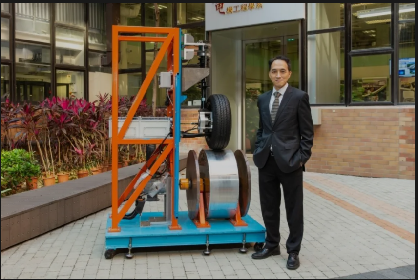

# 2021年9月新闻 / September 2021 news

## 电机设计 Electric Machine Design

### 新结构 New structure

### 优化设计 Optimal design

## 控制 Controls

## 电磁计算 Computational Electronics

## 无线传能 WPT

## 机器学习 Machine Learning

## 其他

- [我一脚下去，稳了！](https://mp.weixin.qq.com/s/IZC27pQKQYUUCkSR5YU4yQ)
  理大电机工程学系的郑家伟教授做的纯电带ABS的刹车系统，或许我们也可以研究一下全电动刹车的执行电机方案。

  
  
  相关论文：
  - [All-electric intelligent anti-lock braking controller for electric vehicle under complex road condition](https://ieeexplore.ieee.org/document/7845986)
  - [Four-Wheel Anti-Lock Braking System With Robust Adaptation Under Complex Road Conditions](https://ieeexplore.ieee.org/document/9309155)