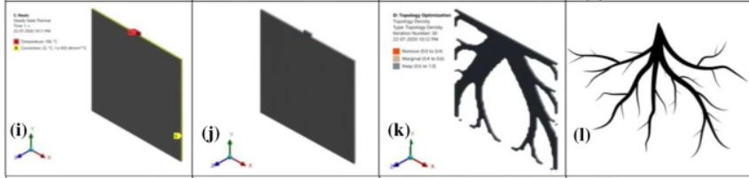
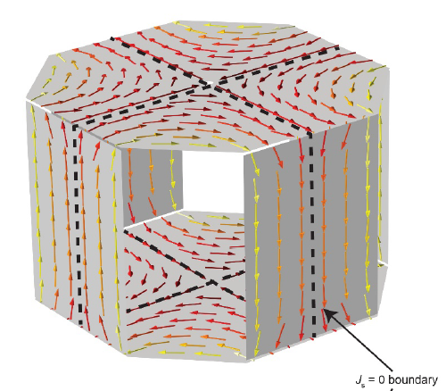

# 2021年9月新闻 / September 2021 news

## 电机设计 Electric Machine Design

### 新结构 New structure

### 优化设计 Optimal design

- [Does Topology Optimization Exist in Nature?](https://link.springer.com/article/10.1007/s40009-021-01050-1)
  拓扑结构优化与仿生设计。个人觉得里面的五个例子选的都挺有意思的，尤其是第三个例子，终于不是结构强度的拓扑优化（这东西例子太多了，尤其是beam之类）。第三个例子讲的是植物吸收水分的例子，非常有意思。下图就是第三个例子。--吴会欢
  
  

## 控制 Controls

## 电磁计算 Computational Electronics

## 无线传能 WPT
- [Room-scale magnetoquasistatic wireless power transfer using a cavity-based multimode resonator](https://www.nature.com/articles/s41928-021-00636-3) 无线充电扩大范围：台灯、风扇在室内任意位置都可充电。视频演示也很有意思。
  
## 机器学习 Machine Learning

- [Deep learning for universal linear embeddings of nonlinear dynamics](https://www.nature.com/articles/s41467-018-07210-0)
  利用深度学习找规律，2018年的文章。
- [Data-driven discovery of coordinates and governing equations](https://www.pnas.org/content/116/45/22445)
  通过数据挖掘发现规律，2019年。这篇文章用一个基于autoencoder的模型找规律，我发现都可以说是“approximation”。
- [Deep Learning to Discover Coordinates for Dynamics: Autoencoders & Physics Informed Machine Learning](https://www.youtube.com/watch?v=KmQkDgu-Qp0)
  2021年8月13日的Youtube视频，也是讲类似的东西。

## 其他

- [FAQ：如何加快Maxwell2D瞬态场求解速度？](https://mp.weixin.qq.com/s/Z6Q8c48AY6by-a27AyLeCQ)
  来自“ANSYS中国”的推荐设置

- [我一脚下去，稳了！](https://mp.weixin.qq.com/s/IZC27pQKQYUUCkSR5YU4yQ)
  理大电机工程学系的郑家伟教授做的纯电带ABS的刹车系统，或许我们也可以研究一下全电动刹车的执行电机方案。

  

  相关论文：
    - [All-electric intelligent anti-lock braking controller for electric vehicle under complex road condition](https://ieeexplore.ieee.org/document/7845986)
    - [Four-Wheel Anti-Lock Braking System With Robust Adaptation Under Complex Road Conditions](https://ieeexplore.ieee.org/document/9309155)